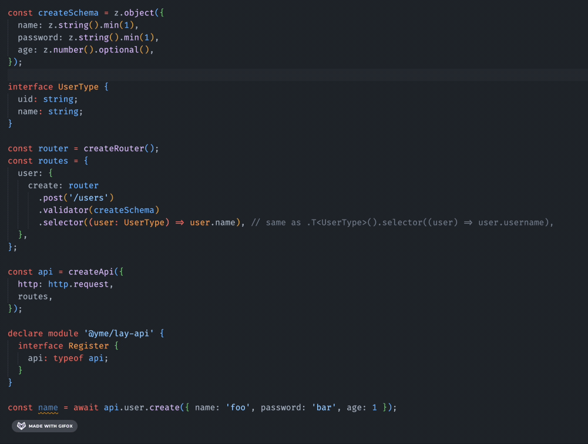

Hey 👋, `@yme/api` is a package that defines the type-safe API routes. No server required and zero dependencies.

> If you are developing a full-stack web application, you should take a look [tRPC](https://trpc.io/).

[](https://www.npmjs.com/package/@yme/api)
[](https://www.npmjs.com/package/@yme/api)
[](https://www.npmjs.com/package/@yme/api)



## Install

```sh
npm i @yme/api
```

## Quick Start

Read the [Documentation](https://yme.kagabase.com/).

## Link

- Use with react [react-api](./packages/react-api/readme.md)

## License

MIT
